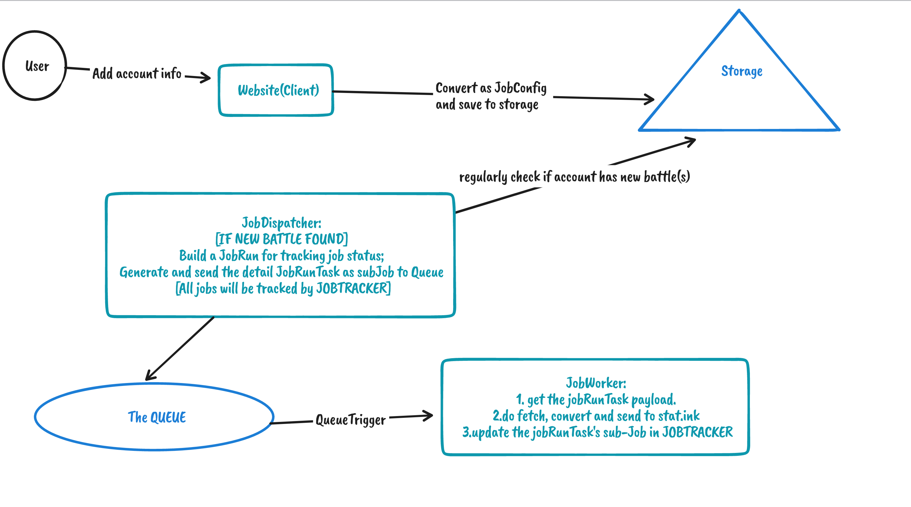

# stat.itok

A tool/system for connecting your splatoon3 battle history(nsoapp) to [stat.ink](https://stat.ink/)

> **Hosted on Azure now: https://stat.itok.xyz/**
>
> And check the run status on JobTrackerX: http://jobtracker.itok.xyz/ （show no jobs if no one play the game 🙂）

## Basic Info
Programing language: C#

Azure service used:

- Azure Storage
  - Blob: Cache battle detail responses.
  - Queue: For internal fetch detail job task.
  - Table: Store raw Nintendo account info(Session Token), store battle id map for deduplication
- Azure Static Web App
  - Static Web App
  - Backend functions(HTTP Triggers): handle new Nintendo account info(**Job Config**)
- Azure Functions
  - Timer Trigger: Job Dispatcher, regularly check new battles for each **Job Config**, If any new battles, build a **Job Run** which contains **Job Run Tasks** , send the **Job Run Tasks** to Azure Queue Storage for Queue Trigger
  - Queue Trigger: 
    - Job Worker: Handler for normal detail battle fetch job.
    - Job Poison Worker: Handler for bad(poison) detail battle fetch job

## Details
### Concepts:

- `JobConfig`: Just a entity contains auth info for fetch new battle. 
- `JobRun`: A virtual container contains one or many `JobRunTask`.
- `JobRunTask`: A task contains fetch battle detail required information.

### Execution Flow

